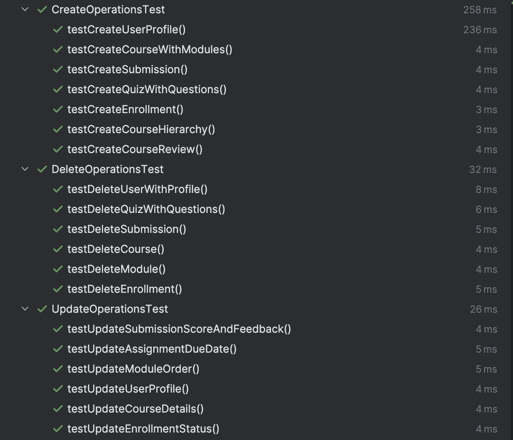
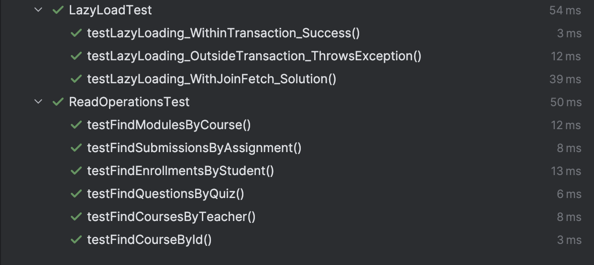
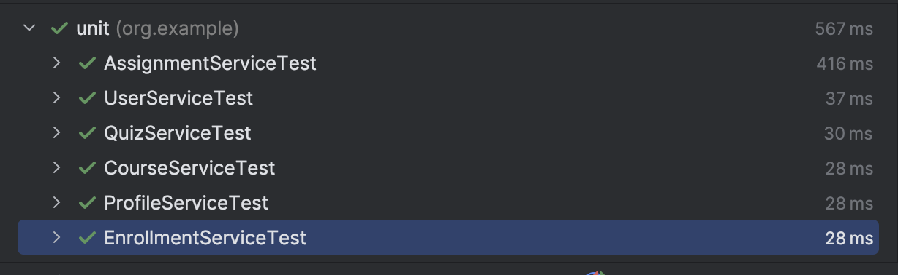

# edu-platform
## Описание проекта
Edu Platform - это система управления онлайн-курсами, построенная на Spring Boot 3.x. Приложение предоставляет функционал для создания курсов, управления учебными материалами, проведения тестирования и отслеживания прогресса студентов.

## Технологический стек

- **Backend**: Spring Boot 3.4.0
- **База данных**: PostgreSQL (production), H2 (testing)
- **ORM**: Spring Data JPA (Hibernate)
- **Язык**: Java 17
- **Сборка**: Maven
- **Тестирование**: JUnit 5, Spring Boot Test

## Структура проекта

```
src/
├── main/
│   ├── java/org/example/
│   │   ├── config/
│   │   │   └── DataLoader.java          # Инициализация тестовых данных
│   │   ├── controllers/                 # REST контроллеры
│   │   ├── entities/                    # JPA сущности
│   │   ├── repositories/                # Spring Data репозитории
│   │   ├── services/                    # Бизнес-логика
│   │   └── Main.java                    # Точка входа
│   └── resources/
│       ├── application.properties       # Основные настройки
│       ├── application-dev.properties   # Настройки разработки
│       └── application-test.properties  # Настройки тестирования
└── test/
    └── java/org/example/integration/    # Интеграционные тесты
```

## Основные сущности

- **User** - Пользователи (Студенты, Преподаватели, Администраторы)
- **Course** - Курсы
- **Module** - Модули курса
- **Lesson** - Уроки
- **Assignment** - Задания
- **Quiz** - Тесты
- **Question** - Вопросы тестов
- **Enrollment** - Записи на курсы
- **Submission** - Отправленные решения
- **Profile** - Профили пользователей
- 
## DataLoader
Проект включает компонент `DataLoader`, который автоматически заполняет базу данных тестовыми данными при первом запуске приложения.

## Быстрый старт

### 1. Клонирование репозитория

```bash
git clone <repository-url>
cd edu-platform
```

### 2. Настройка базы данных

#### Для разработки (H2 in-memory):
```bash
# Автоматически создается при запуске
# Настройки в application.properties:
# spring.datasource.url=jdbc:h2:mem:testdb
```

### 3. Сборка и запуск

```bash
# Сборка проекта
mvn clean package

# Запуск приложения
mvn spring-boot:run

# Или запуск собранного JAR
java -jar target/edu-platform-1.0-SNAPSHOT.jar
```

Приложение будет доступно по адресу: `http://localhost:8080`

## REST API Endpoints

### Пользователи
- `GET /api/users` - Получить всех пользователей
- `GET /api/users/{id}` - Получить пользователя по ID
- `GET /api/users/{email}` - Получить пользователя по email
- `POST /api/users` - Создать пользователя
- `PUT /api/users/{id}` - Обновить пользователя
- `DELETE /api/users/{id}` - Удалить пользователя

Аналогично для других сущностей


## Тесты



### Запуск тестов

```bash
mvn test
```

### Описание тестов

- **CreateOperationsTest** - Тестирование создания сущностей и каскадного сохранения
- **ReadOperationsTest** - Тестирование операций чтения и целостности данных
- **UpdateOperationsTest** - Тестирование обновления сущностей
- **DeleteOperationsTest** - Тестирование удаления и каскадного удаления
- **LazyLoadTest** - Тестирование ленивой загрузки связей
## CI workflow настроен
## Docker запуск

```bash
# Сборка Docker образа
docker build -t edu-platform .

# Запуск контейнера
docker run -p 8080:8080 edu-platform
```

